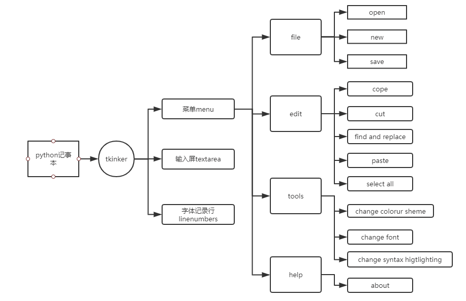
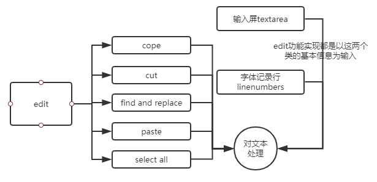

# 小米便签泛读报告

## 前言 ##
   本组对于小米便签的开源代码较有兴趣，故小组成员经过一番研究讨论后根据对小米便签开源代码的理解撰写此篇泛读报告
## 正文 ##
#一、功能分析#

小米便签是一款以小米手机为独家特有的手机自带app，用户通过此app可以进行新建便签，存储记录内容等功能。而一进入app时，小米便签便会自动创建一条便签。而小组经过对每个类的分析后发现小米便签有如下功能

1.编辑小米便签：
通过点击小米便签内部并进行文字输入即可进行编辑

2.新建小米便签：
通过小米便签软件的主界面下方的“写便签”快捷键和文件夹、便签视图下的选项“新建便签”可以在当前目录创建一个便签并打开进入文本编辑。其中主界面下的快速创建方式可以迅速创建一个待编辑的便签，用于满足临时迅速记录的需求。

3.删除小米便签：
通过点击小米便签的菜单，打开菜单点击删除，当系统打开提示：“是否删除该条便签”点击删除后即可删除当前的便签。

4.设置文本大小：
通过点击小米便签的菜单，打开菜单点击设置文本大小，将文本大小调制自己的理想字体大小后点击确认即可将小米便签中的文字变成心目中的理想字体。

5.设置闹钟提醒：
通过点击小米便签的菜单，打开菜单点击提醒闹钟并设定时间，当时间一到达闹钟便会响铃并振动进行提醒。

6.更换色彩皮肤：
点击右上角的更换显示屏表面色彩功能，点开后在五种颜色中选取自己喜欢的一种，满足顾客对于便签颜色的需要，点击选择颜色后便签输入屏便会转换成所选取的颜色。

7.列表选择便签：
进入最开始的界面，列表以简略形式显示手机所存储的所有便签，客户科可点击其中一个便签以activity形式转换进入便签中。

8.清单模式：
点击菜单选取清单模式，可使便签内容前方加入选择框，如果点击选择框便会在选择框中出现勾选痕迹代表清单中的一项已经完成，如果再次点击便会抹去痕迹代表清单此项并未完成。

9.长按删除：
在列表中用手指长按所选便签便可在右侧显示勾选框并给该便签进行勾选，点击下方删除键便可删除此便签。

10.GTask的设置和同步：
进入列表模式点击左侧菜单，点击GTask设置和同步，便可将小米便签与网络账号相互连接，GTasks是一款安卓平台的任务、日程管理和记事工具，它力图通过简单的操作来帮您完成任务计划和任务跟踪，支持与Google Tasks的双向同步，让您的任务保存在云端永不丢失。通过将小米便签上传至云端便可不仅将小米便签内容存储在本机中，也可在使用其他小米手机时登陆GTask获取云端中的小米便签内容。

11.导出文本：
进入列表模式点击左侧菜单，点击导出文本便可将所选择的小米便签的内容导入到所指定的地点。

12.搜索：
进入列表模式点击左侧菜单，选择搜索功能，通过搜索相关关键字对应的便签来完成搜索功能。

13.新建文件夹：
进入列表模式点击左侧菜单，选择新建文件夹，当便签过多时可通过新建文件夹来放置不同分类的便签来方便客户来寻找相关类型的便签。

14.分享：
进入列表模式长按所选择便签，点击右侧菜单选择分享功能，便可将便签内容分享至所想要分享的对象

通过对以上功能总结，小米便签类似一个简洁版的任务管理应用。

#二、代码分析#

* 添加功能
经过讨论后我们所有人对于代码的优劣进行了分析并对部分代码的优化提出了以下构想

总的类tkinter.tk是一个窗口当程序运行时候这个窗口.mainloop()循环检查执行
包含了好几个属性
.title 窗口的标题
.geometry 窗口的大小
.foreground 窗口的底色
.background 窗口的颜色
.text_foreground 字的底色
.text_background 字的颜色
.font_size字的大小
.load_font_file()打开某个文件
.text_area 记事本的输入屏
.line_numbers 记事本输入屏的行数
.menu窗口最上方菜单包含了["file", "edit", "tools", "help"]每个菜单栏包含了各自的按钮
"file"
def file_new（）表示新建一个文件
def file_open（）表示打开一个已经存在的文件
def file_save（）表示存储当前内容为一个新的文件
"edit"
def edit_cut（）剪切文本
def edit_paste（）粘贴文本
def edit_copy（）复制文本
def edit_select_all（）选择全部文本
def edit_find_and_replace（）对文本进行查询和替换，我在这里进行了修改源码cancel显示不足的bug和补充新功能替换全部
"help"
def help_about（）查看使用帮助弹出一个窗口
 "tools"
def tools_change_syntax_highlighting（）改变被选择的颜色
def tools_change_colour_scheme（）改变主题颜色
def tools_change_font（）改变字体颜色
* edit功能详解

展现了小米便签通过输入屏实现对文体的控制以及对问题的各项操作：copy复制、cut剪切、find and replace寻找并替换、paste粘贴、select all全选。以textarea输入屏和linenumbers字体记录行实现对文本处理。可知edit功能实现都是以实现textarea和linenumbers这两个类的基本信息来进行的。

##结语##
我们小组通过本次分析代码，进行小米便签运行环境配置（Eclipse、AndroidStudio）的过程中掌握了多种插件的使用，这些插件可以大大提高代码分析的效率；而且由于已经提前学过面向对象并且正在学习安卓的相关知识，使我们在这些方面得到了较多的知识，对于代码和软件的运行有了更多方面的了解，接下来我们小组还将继续深入探索小米便签。