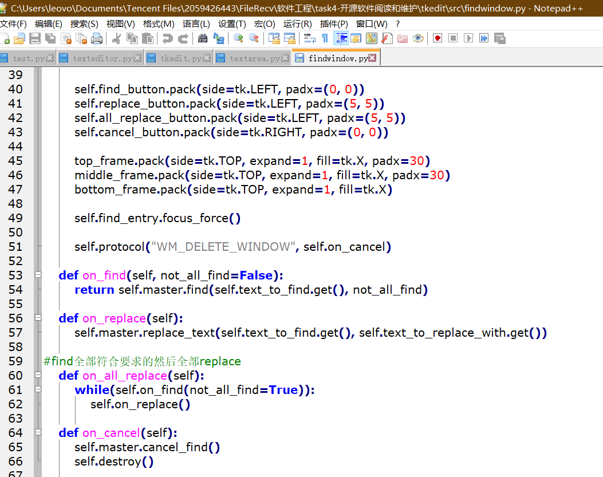

#小米便签需求与设计报告

##功能需求##
1.添加小米便签 

（1）功能描述：

用户通过app添加便签记录全新便签内容。

（2）实现方法：

启动小米便签，进入初始页面，点击下方添加便签功能即可进入便签。

（3）运行结果：

添加了全新的便签进行新的文体编辑。

2.删除小米便签 

（1）功能描述：

用户通过app删除便签且删除便签内容并将便签所占内存进行清空。

（2）实现方法：

启动小米便签，进入要删除的便签，点击左侧菜单，点击删除功能并在弹出的提示窗中点击确认即可删除便签。

（3）运行结果：

删除了对应的便签并对内存进行了清理。

3.设置文本大小

（1）功能描述：

用户通过app内的菜单将便签的字体调制成自己所理想的字体大小。

（2）实现方法：

启动小米便签，进入一个便签中，点击左侧菜单，点击改变字体大小栏，设置自己所理想的字体大小。

（3）运行结果：

字体大小改变成客户所设置的参量。

4.设置闹钟提醒 

（1）功能描述：

用户通过app将便签内容通过闹钟对客户进行提醒从而让客户在规定时间记忆起便签所记录的内容。

（2）实现方法：

启动小米便签，进入所需要设置闹钟的便签，点击左侧菜单，点击设置闹钟栏并对闹钟时间进行定义。

（3）运行结果：

在规定时间闹钟进行响铃，并在手机屏幕上显示设置闹钟的便签的内部内容。

5.更换色彩皮肤 

（1）功能描述：

用户通过app功能将便签输入屏颜色进行改变。

（2）实现方法：

启动小米便签，进入其中一个便签，点击右上角图标，在五种颜色中选取其中一种进行输入屏颜色改变。

（3）运行结果：

便签输入屏颜色改变成用户所选择颜色。

6.列表选择便签 

（1）功能描述：

用户通过app列表查看用户所拥有的便签。

（2）实现方法：

启动小米便签，进入初始页面并至少拥有一个便签。

（3）运行结果：

所有便签以列表形式展现在客户前供客户进行选择。

7.清单模式

（1）功能描述：

用户通过app将便签内容以清单形式进行展示供客户进行勾选。

（2）实现方法：

启动小米便签，进入需要改变成清单模式的便签，点击左侧菜单选择清单模式功能。

（3）运行结果：

便签内容以清单形式进行展示，用户可通过对内容左侧栏进行勾选以提醒客户清单此栏是否已完成。

8.GTask的设置和同步 

（1）功能描述：

用户通过app将便签与Gtask云端进行连接以便内容能从账户中进行提取。

（2）实现方法：

启动小米便签，进入初始页面，点击左侧菜单，点击GTask栏，输入GTask账户与密码，选择同步。

（3）运行结果：

GTask云端与小米便签同步，即使在其他手机中也可将GTask登陆后将云端与另一手机进行同步功能。

9.导出文本 

（1）功能描述：

用户通过app将便签内容导出至手机内存指定路径。

（2）实现方法：

启动小米便签，进入需要导出文本的便签，点击左侧菜单，点击导出文本栏，选择指定路径进行确定。

（3）运行结果：

指定路径出现便签内容的txt文件。

10.搜索

（1）功能描述：

用户通过app搜索客户所需要的便签。

（2）实现方法：

启动小米便签，进入初始页面，点击右侧放大镜，输入关键字，app根据关键字自动搜寻直到用户点击所需便签。

（3）运行结果：

用户进入拥有关键字的便签中查看内容。

11.新建文件夹

（1）功能描述：

用户通过app在添加内存的便签文件夹中新添加文件夹。

（2）实现方法：

启动小米便签，进入初始页面，点击左侧菜单，点击新建文件夹栏，输入新建的文件夹名字，点击确认。

（3）运行结果：

出现用户命名的新文件夹。

12.分享

（1）功能描述：

用户通过app将便签内容分享给指定对象。

（2）实现方法：

启动小米便签，进入客户所想分享的便签，点击左侧菜单，点击分享，并指定对象后点击确认。

（3）运行结果：

便签内容分享给指定用户。

##优化方案##

添加了find and replace功能，可输入相关关键字将文本中所有的关键字替换成文本所需要的关键字。

而在优化方面，我们在texteditor中优化了旁边的行数字体大小和文本同步，以防止小米便签中旁边的字模糊不清以及方便客户进行输入而避免小米便签文体不同步所对客户造成的困扰。

优化后的结构图正如我们之前泛读后所描慕的结构图一样如下

##结论##
小米便签确实是对于所有的使用客户提供了较大的方便，而关于小米便签中许多的黄色警告也是小米便签编写者自行做出的一些优化小米便签的编码方式也使我们收益良多，而我们也更加懂得了客户的需求分析，对于我们小组以后的代码编写提供较大的帮助。